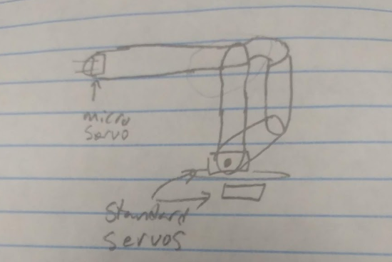

## Goal 
Use a color sensor to sort, stack, and unstack boxes Have a mode where the arm can be controlled by 4 potentiometers and a button Have an indicator LED that displays the current color of the box Use an electromagnet to pick up the boxes Use a color sensor to detect the color of a box

## Design 
Will use 3 standard servos and 1 micro servo All of them are 180° servos The boxes will start in holes on the base, in a circle The boxes will be laser cut acrylic and the magnets will be glued into place 4 potentiometers and 1 button are needed for the manual control mode The color sensor will be arranged next to the electromagnet, but not necessarily right up against it The base will rotate with a gear system, so the servo isn’t in the center of rotation The majority of the arm will be made from laser cut acrylic
 
## Schedule 
12/5: Begin planning  
12/6: Begin Solidworks design  
12/6: Begin code and wiring  
1/17: Finish Solidworks design & begin laser cutting/3D printing  
2/25: Finish assembly, begin documentation  
2/28: Finish project 

## Materials 
* Color Sensor 
* Electromagnet 
* Metro M0 Express 
* 3 standard servos 
* 1 micro servo 
* 3.18 mm Acrylic 
* 9V Battery Pack 
* RGB LED (color indicator) 
* 1 Red LED (power indicator) 
* 2 switches, 1 for power, 1 for mode 
* 4 potentiometers 
* 1 button 
* Something ferromagnetic, like iron 
* Wires

## Criteria and Constraints 
Must be made with parts that can be found in the Sigma Lab, or easily acquired  
Must be completed by some date  
Must use 4-6 servos  
Must include meshing gears  
Must complete the task (pick up boxes and sort them by color)  

## Issues and solutions
This section makes up some issues we encountered and our solutions. One issue with the code happened when we tried to get all the servos to work. We had run out of PWM pins. After trying many different combinations of pins, we figured out that we might be able to get rid of the PWM with the RGB LED (it was less important) and only use it for the servos. So we made a system for pseudo-PWM, but it just wasn't fast enough, especially as lower light levels. After some research and help from Dr. Shields we officially gave up, as it was either impossible or  far beyond our level. Another issue was that we couldn't have the arm rotate enough to realistically reach all the boxes while also turning only 180 degrees, so we decided to use a 2:1 gear ratio on the servo. We decided to go with the SolidWorks toolbox gears as they are easy to set up. However, we needed to modify them, so we made a derived part. In the future it would be easier to make it from scratch. These two gears were plagued by mysterious problems like reverting changes, having edits sometimes synced across them and others. It was a nightmare. In truth, this broke again close to when we had to stop, so it wasn't even fully fixed. We also had to redesign the base after we realized we needed to have boxes in exact locations to have autonomous mode work. We then created a base with six right angles we could line the boxes up against. 

## What we didn't finish/retrospective
We did not finish our robot arm project. We did finish the wiring and code, although it was never tested with battery power. We were still working on the SolidWorks when we had to stop, although the boxes were fully modeled. We had a decent amount of tweaks left before we would finish also. When we stopped we still needed to finish modelling the base, and add holes in it for the wires, buttons, switches, and LEDs. We needed to fix the issue of the screws on the four bar linkage that greatly restricting the movement of the arm. Because we never finished the SolidWorks part we never started construction of the physical arm. This meant that we never made the autonomous mode. We couldn't have gotten farther had we not spent so long on workarounds and optimistic solutions that were doomed from the start.
